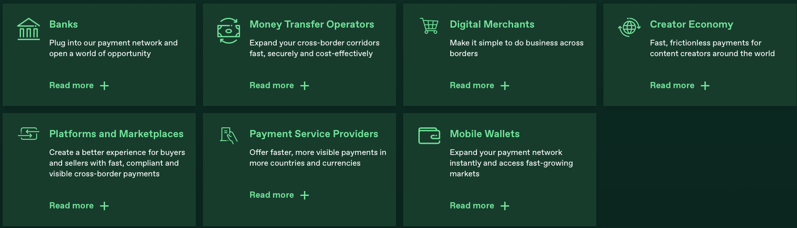
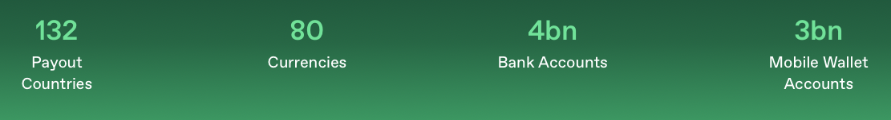
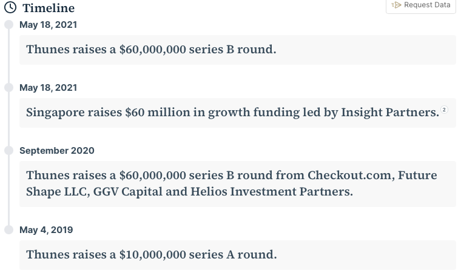
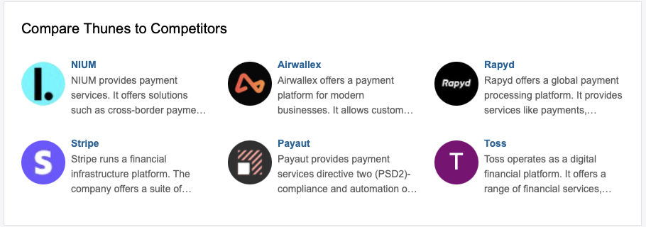

# Thunes. Case Study

## Overview and Origin
**Thunes is a cross-border payments company founded in 2016 by Eric Barbier.** 

**Before Thunes was born there was TransferTo who was founded in 2006 with the idea that** "transfering money should be as easy as sending a text message." **On the 18th of February 2019 it was splited into two companies Thunes and DTOne.** 
   **Thunes mission is to reach unbanked people through the Thunes APIs. Nevertheless, today Thunes is moving money seamlessly and transparently accross borders for businesses and customers alike using four key products: Pay, Accept, Exchange and Comply** \
**Some of Thunes' customers are:** \
  
**Siam Commercial Bank** \
**Dashen Bank** \
**ABA Bank** \
**Bank Alfalah** \
**Some of Thunes' service offerings are:** \

**Cross-border payments world is a very rewarding ecosystem that has a revenue of over $200 billion and it is expanding evry year with a single-digit annual growth rate. According to a research made by Citi Bank [Future of Cross-Border Payments](https://www.citigroup.com/global/insights/citigps/future-of-cross-border-payments-).**\
**The cross-border payments landscape is changing rapidly as customers are looking for streamlined, transparent, 24x7 realtime experience. This is true as well for businesses of all industries. Payments are more and more shifting from the traditional instructional methods to the application programming interface (API). FinTech companies like Thunes are taking more shares. Numbers show that over 40% of banks have lost at least 5% of market share and the future doesn't look bright as about 89% of them are projected to lose at least 5% of their share to FinTech companies in the next 5-10 years.**\
**You may never heard about Thunes as you send money to your loved ones overseas, but as you are using services like Western Union, PayPal you are using Thunes network. Indeed Thunes is using its API to probel other corporations and help them achieve their goal.**\
**Some numbers:**\

**Thunes has about 3 billion mobile wallet accounts, 4 billion bank accounts connected through its network of partners amongs which are M-Pesa in Kenys, WeChat in Asia, Uber, PayPal, MoneyGram and so much more. It guaranties about 300 payment methods around 132 countries and 80 currenties and is present on 70 markets. All that allows Thunes to process more than $50 billion in transactions.**\
* Thunes' total funding: $202M.
* Thunes' annual revenue: $55.8M
* Thunes's valuation: $900M

| Name | Funding Type | Funding Round Amount in million (USD) | Date | 
|:------:|:-----------:|:-----------:|:-----------:|
| Thunes Series B round | Series A round | 10 |May 4, 2019 |
| Thunes Series B round | Series B round | 60 | September 2020 |
| Thunes Series B round | Series B round | 60 | May 18, 2021 |
 
**In June 2023 Thunes raised $60 million in Series C round.**

**What about the competition?**\
**The competition is very large as the market sees frequent new comers.**
\
**To be able to evaluate effectiveness of Cross-Border Payment Solutions, Key Performance Indicators (KPIs) are ussed. Some of the the KPIs are:**\
* Transaction volume:  Transaction Volume= Total number of cross-border payment transactions.
* Transaction value:  Transaction Value= Total Value of Cross-Border Payment Transactions.
* Conversion rate:  Conversion Rate=(Number of Conversions/Total Number of Visitors or Potential Customers)*100.
* Average transaction size: Average transaction size=Total Value of Transactions/Total Number of Transactions.
* Customer acquisition cost: CAC= Total Marketing and Sales Expenses/Number of Customers Acquired. 
* Customer retention rate: Customer Retention Rate= ((CE-CN)/CS)*100 where CE: is the number of customers at the end of a specific period, CN: is the number of new customers acquired during that period, CS: is the number of customers at the start of that period.
* Average processing time: Average Processing Time=Total Processing Time/Number of Cross-Border Payments.\
**I  think that Thunes would gain by adding some major component like Billing and Invoicing, indeed by integrating AI on their platform they will better serve their customer by offering a one stop solution.**\
**We can also notice that they are not offering any cryptocurrencies. This is a must as cryptocurrencies don't need any conversion and there is a better traceability of the transactions. In general having Blockchain services in their products will be a great boost.**

[References]()
* https://www.thunes.com/about-us/
* https://worldfinancecouncil.org/speaker/eric-barbier/
* https://review.insignia.vc/2022/06/20/season-4-episode-18-triplea-eric-barbier-crypto-payments-fintech/
* https://golden.com/wiki/Thunes-MN59ZPW
* https://www.thunes.com/news/transferto-announces-rebrand-with-the-creation-of-two-market-defining-companies-dt-one-and-thunes/
* https://www.thunes.com/news/introducing-new-modular-cross-border-payment-capabilities/#:~:text=Since%20our%20beginnings%20in%202016,seamlessly%20and%20transparently%20across%20borders.
* https://www.cbinsights.com/company/thunes
* https://www.citigroup.com/global/insights/citigps/future-of-cross-border-payments-
* https://techcrunch.com/2023/07/17/thunes-pockets-72m-at-a-900m-valuation-to-expand-its-cross-border-b2b-payment-platform/
* https://growjo.com/company/Thunes
* https://www.forbes.com/sites/davidprosser/2021/11/12/how-thunes-is-building-a-new-payments-system-for-the-world/?sh=4aaa317f796d
* https://finmodelslab.com/blogs/kpi-metrics/cross-border-payment-solutions-kpi-metrics
