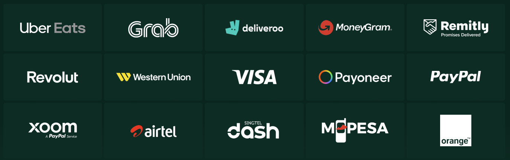

# Thunes. Case Study

## Overview and Origin
**Thunes is a cross-border payments company founded in 2016 by Eric Barbier.** 

**Before Thunes was born there was TransferTo who was founded in 2006 with the idea that** "transfering money should be as easy as sending a text message." **On the 18th of February 2019 it was splited into two companies Thunes and DTOne.** 
   **Thunes mission is to reach unbanked people through the Thunes APIs. Nevertheless, today Thunes is moving money seamlessly and transparently accross borders for businesses and customers alike.** \
**Some of Thunes customers are:** \
 \ 
**Siam Commercial Bank** \
**Dashen Bank** \
**ABA Bank** \
**Bank Alfalah** \
**Some of Thunes services offered are:** \

[References]()
* https://www.thunes.com/about-us/
* https://worldfinancecouncil.org/speaker/eric-barbier/
* https://review.insignia.vc/2022/06/20/season-4-episode-18-triplea-eric-barbier-crypto-payments-fintech/
* https://golden.com/wiki/Thunes-MN59ZPW
* https://www.thunes.com/news/transferto-announces-rebrand-with-the-creation-of-two-market-defining-companies-dt-one-and-thunes/
* https://www.thunes.com/news/introducing-new-modular-cross-border-payment-capabilities/#:~:text=Since%20our%20beginnings%20in%202016,seamlessly%20and%20transparently%20across%20borders.
* https://www.cbinsights.com/company/thunes
